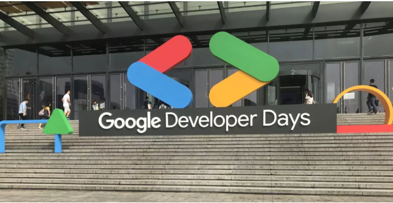
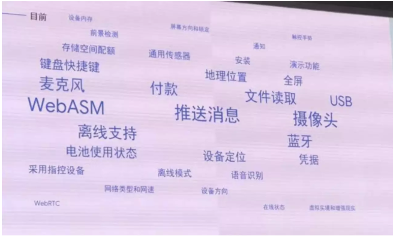
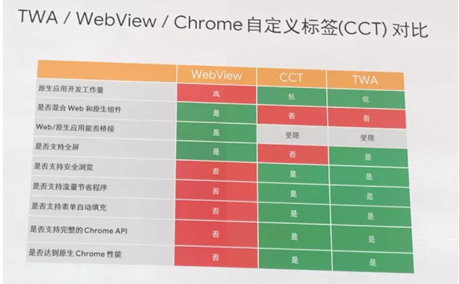

# google2019开发者大会带来的Web App思考

# Web App

## PWA和AMP的推广

### PWA(Progressive Web APP)
渐进式 Web 应用。主要解决的问题：
1. 可以添加至主屏幕，点击主屏幕图标可以实现启动动画及隐藏地址栏
2. 实现离线缓存功能
3. 实现了消息推送

实现原理是通过Service worker拦截进出的HTTP请求和将数据缓存于本地，所以可以不受网络状况影响去加载首屏。

谷歌的一个Service worker框架workbox

关于PWA和workbox的介绍 https://www.cnblogs.com/EnSnail/p/9824198.html

### AMP（Accelerated Mobile Pages）
移动页面加速，据说再移动端首屏展现速度提高15% ~ 85%。

AMP主要由三个部分组成：
* AMP HTML
* AMP JS
* AMP Cache

主要的优化网页内容，对于逻辑复杂导致的速度慢没啥用

具体优化方式的参考阅读 https://www.cnblogs.com/qcloud1001/p/7839269.html

## Web 能力的 Native 化
### 一些新的web api：
* 分享
* 系统层面的媒体控制
* 检测条码二维码
* App Badging
* 唤醒锁
* 文件操作
* 访问串口设备（例如打印机）
* 访问通讯录
* 访问安装字体列表
* 复制粘贴图片

## TWA将PWA包装成Native App

### Trusted Web Activity 

在安卓开发环境Android Studio下添加TWA 组件等依赖就可以实现网页的包装。

解决了AMP最大的痛点，不能生成应用证书

TWA 结合 PWA，在未来就会是正式的 WebApp 雏形了。

# flutter

### Flutter To web发布

flutter推荐学习网站
https://github.com/xitu/awesome-flutter

## 小结
Web开始融合其他领域，大前端的趋势明显
